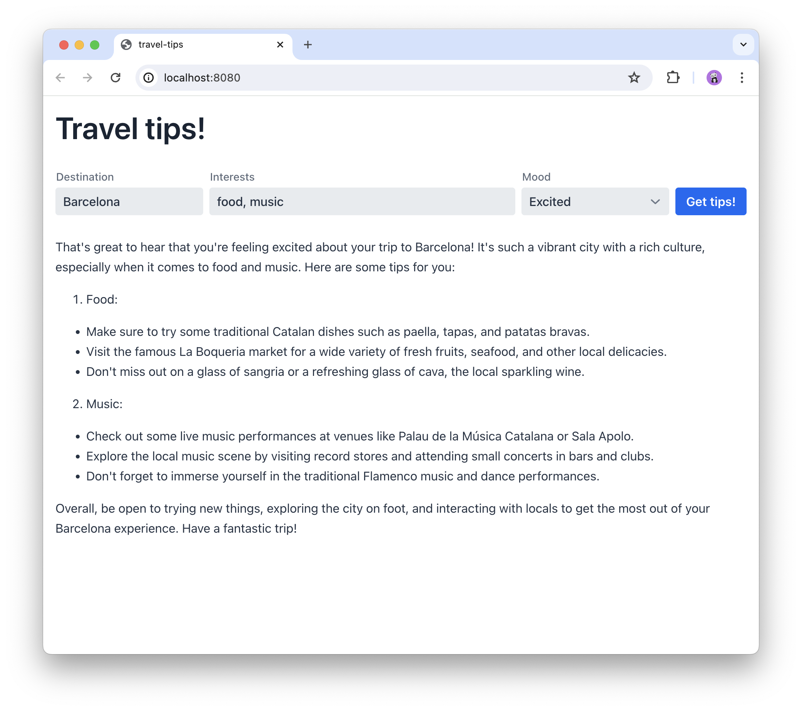

# Travel Tips: a GraalVM native full-stack web app with Hilla and Spring Boot

This demo app shows how to build a full-stack app with Hilla and Spring Boot, and compile it to a native executable with GraalVM.



## Prerequisites
- [GraalVM](https://www.graalvm.org/)

## Development

You can run the app in development mode with the following command:

```bash
mvn
```

or by running the `Application.java` class in your IDE.

## Building a native executable

You can build a native executable with the following command:

```bash
mvn -Pproduction -Pnative native:compile
```

Run the native executable with the following command:

```bash
target/travel-tips
```